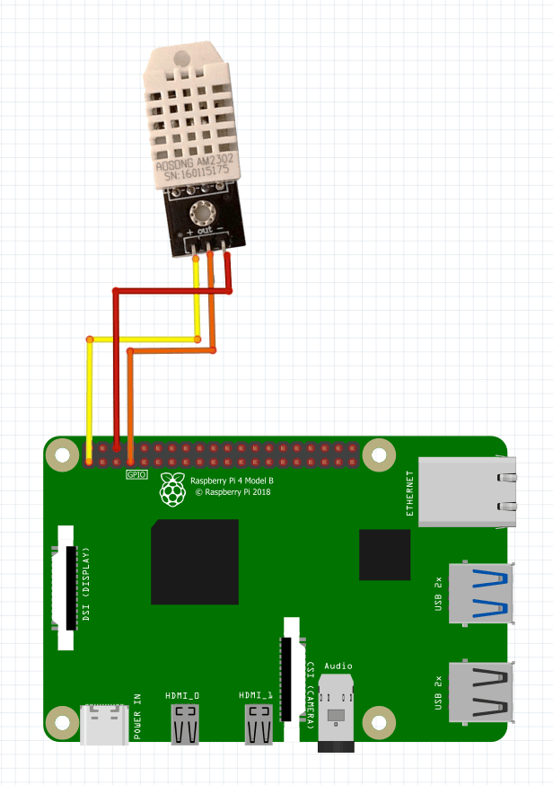

# MMM-DHT
Uses a DHT22 sensor to read the temperature and humidity, and display on your MagicMirror2. If you are using another sensor you will need to modify the `DHT.py` file 

## DHT22 Wiring


## Install
```
cd  ~/MagicMirror/modules
git clone https://github.com/ckoutavas/MMM-DHT
sudo pip3 install -r requirements.txt
```

## config

```javasctip
{
  module: 'MMM-DHT',
  position: 'top_right',
  config: {}
},
```
## Config Params

| Param      | Type | Default    | Options                             | Description                                                                            |
|------------|------|------------|-------------------------------------|----------------------------------------------------------------------------------------|
| tempUnit   | str  | "F"        | ["F", "C"]                          | The temperature unit that you want to return                                           |
| freq       | int  | 60000      | Any int value                       | The interval at which you want to check the temperatureand humidiy from the DHT sensor |
| keep       | str  | "both"     | ["both", "temperature", "humidity"] | Specify the values you want to keep from the DHT sensor                               |
| colorParam | str  | "humidity" | ["humidity", "temperature"]         | Choose the param that you want to use to color the text on screen                      | 
| highVal    | int  | 60         | Any int value                       | If the colorParam is >= highValue then set the highColor                               |
| lowVal     | int  | 50         | Any int value                       | If the colorParam is <= lowValue then set the lowColor                                 |
| highColor  | str  | "red"      | Any html color name, hex, etc.      | The color used when the colorParam is >= highVal                                       |
| lowColor   | str  | "blue"     | Any html color name, hex, etc.      | The color used when the colorParam is <= lowVal                                        |
| midColor   | str  | "green"    | Any html color name, hex, etc.      | The color used when the highValue < colorParam > lowVal                                |

